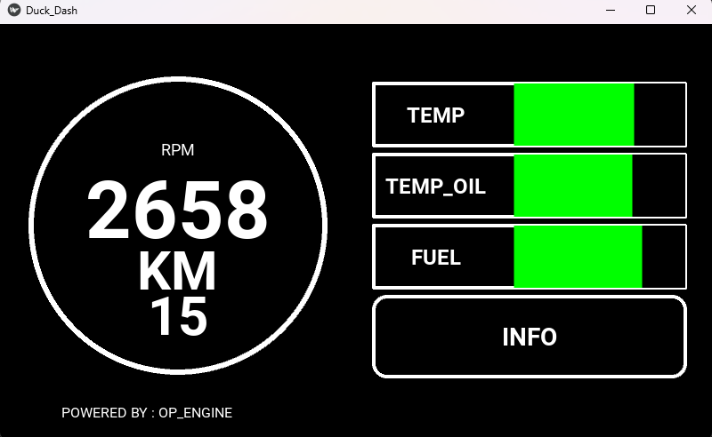

# Duck_Dash 

## 🇮🇹 Italiano

Dashboard digitale per strumentazione veicoli.



## Caratteristiche

- 🎯 **Tachimetro RPM/KM circolare** con valore grande e leggibile
- 📊 **Barre info** per TEMP, TEMP_OIL, FUEL con colori dinamici
- 🎮 **Modalità DEMO** con simulatore dati realistico
- ⌨️ **Controlli tastiera** per test immediati
- 🖥️ **Display fisso 800x480** ottimizzato per touchscreen 7"
- 🔌 **Preparato per OBD2** (integrazione futura)

## 🚀 Quick Start

### Requisiti
- Python (3.8)-(3.11.x)
- Kivy 2.3.0
- Python-obd

## Controlli Tastiera

| Tasto | Azione |
|-------|--------|
| `↑` / `↓` | Velocità ±10 km/h |
| `↑` / `↓` | RPM ±500 |
| `1` | Preset Idle (800 RPM) |
| `2` | Preset Città (2000 RPM, 50 km/h) |
| `3` | Preset Autostrada (3000 RPM, 130 km/h) |
| `4` | Preset Sport (6000 RPM, 180 km/h) |
| `ESC` | Esci |

## ⚙️ Configurazione di Base

Modifica `config.py`:

```python
# Modalità operativa
DEMO_MODE = True  # False per usare OBD2 reale

# Display
SCREEN_WIDTH = 800
SCREEN_HEIGHT = 480

# Limiti
MAX_RPM = 8000
MAX_SPEED = 250
WARNING_RPM = 6500
```

## 📁 Struttura Progetto

```
automotive-dashboard/
├── main.py              # Entry point
├── config.py            # Configurazione
├── requirements.txt     # Dipendenze
├── core/
│   ├── simulator.py    # Simulatore dati
│   └── keyboard.py     # Controlli tastiera
|   └── obd_reader.py   # Gestione paramentri OBD
└── ui/
    ├── dashboard.kv    # Layout Kivy
    ├── _init_    
    └── dashboard.py    # Widget dashboard
```
## Design

Layout basato su dashboard automotive moderna:
- **Sinistra**: Cerchio RPM/KM
- **Destra**: Barre info orizzontali (TEMP, TEMP_OIL, FUEL)
- **Colori dinamici**: Verde (OK) → Giallo (Warning) → Rosso (Critico)

## Integrazione OBD2 (Futuro)

Il progetto è preparato per integrazione hardware OBD2:

1. Collega adattatore OBD2 USB
2. Identifica porta (`/dev/ttyUSB0` o `COM3`)
3. Modifica `config.py`: `DEMO_MODE = False`
4. Configura `OBD_PORT`

## 📝 Licenza

MIT 
Leggere il file LICENSE
---

**POWERED BY : OP_ENGINE - Tur3**

----
## 🇬🇧 English
# Duck_Dash

Digital dashboard for vehicle instrumentation.


## Features

- 🎯 **Circular RPM/KM Speedometer** with large, easy-to-read value  
- 📊 **Info bars** for TEMP, TEMP_OIL, FUEL with dynamic colors  
- 🎮 **DEMO Mode** with realistic data simulator  
- ⌨️ **Keyboard controls** for quick testing  
- 🖥️ **Fixed 800x480 display** optimized for 7" touchscreen  
- 🔌 **OBD2-ready** (future integration)  

## 🚀 Quick Start

### Requirements
- Python (3.8–3.11.x)  
- Kivy 2.3.0  
- Python-OBD  

## Keyboard Controls

| Key | Action |
|-----|--------|
| `↑` / `↓` | Speed ±10 km/h |
| `↑` / `↓` | RPM ±500 |
| `1` | Idle preset (800 RPM) |
| `2` | City preset (2000 RPM, 50 km/h) |
| `3` | Highway preset (3000 RPM, 130 km/h) |
| `4` | Sport preset (6000 RPM, 180 km/h) |
| `ESC` | Exit |

## ⚙️ Basic Configuration

Edit `config.py`:

```python
# Operating mode
DEMO_MODE = True  # False to use real OBD2

# Display
SCREEN_WIDTH = 800
SCREEN_HEIGHT = 480

# Limits
MAX_RPM = 8000
MAX_SPEED = 250
WARNING_RPM = 6500
```

#📁 Project Structure

```
automotive-dashboard/
├── main.py              # Entry point
├── config.py            # Configuration
├── requirements.txt     # Dependencies
├── core/
│   ├── simulator.py     # Data simulator
│   ├── keyboard.py      # Keyboard controls
│   └── obd_reader.py    # OBD parameters handling
└── ui/
    ├── dashboard.kv     # Kivy layout
    ├── _init_    
    └── dashboard.py     # Dashboard widget

```
## Design

Layout based on modern automotive dashboards:  
- **Left**: RPM/KM circular gauge  
- **Right**: Horizontal info bars (TEMP, TEMP_OIL, FUEL)  
- **Dynamic colors**: Green (OK) → Yellow (Warning) → Red (Critical)

## OBD2 Integration (Future)

The project is prepared for OBD2 hardware integration:

1. Connect USB OBD2 adapter  
2. Identify port (`/dev/ttyUSB0` or `COM3`)  
3. Edit `config.py`: `DEMO_MODE = False`  
4. Set `OBD_PORT`

## 📝 License

MIT  
See LICENSE file
---

**POWERED BY : OP_ENGINE - Tur3**

---

## ⚠️ Avviso / Notice

🇮🇹 **Avviso:** Il codice è attualmente commentato in italiano, ma presto verrà caricato un file .zip con tutto il codice commentato in inglese.  

🇬🇧 **Notice:** The code is currently commented in Italian, but a .zip file with all code commented in English will be uploaded soon.
